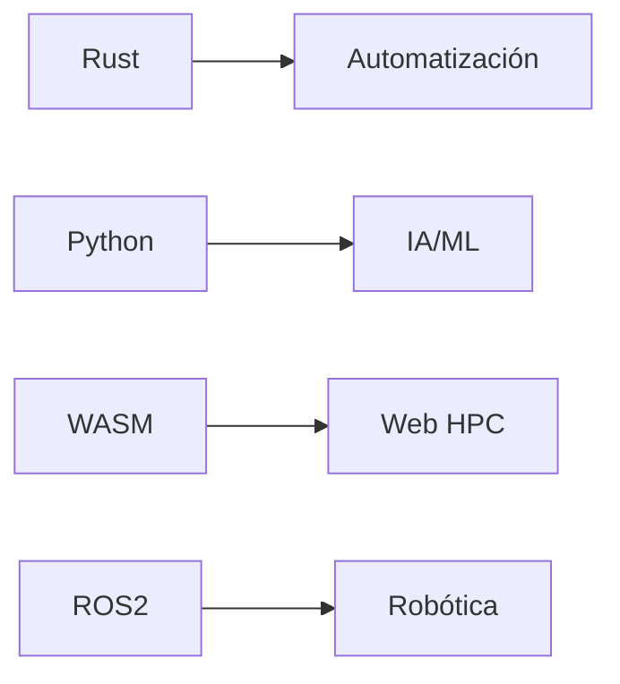

# **🤖 MECHMIND-DWV** | *Ingeniería que redefine límites* 🚀

<div align="center">
  
</div>

**Plataforma central de MechMind-dwv** | Combinamos *hardware inteligente*, *software de vanguardia* y *IA generativa* para soluciones disruptivas.

<div align="center">
  <a href="https://mechmind-dwv.github.io"></a>
  <a href="https://github.com/MechMind-dwv"></a>
  
</div>

---

## **🔍 Núcleo Tecnológico**

### **🧩 Stack Principal**


### **📊 Métricas Clave**
| Área               | Tecnologías                          | Proyectos Activos |
|--------------------|--------------------------------------|------------------|
| **Visión Artificial** | OpenCV, YOLOv8, MediaPipe         | 4                |
| **Cloud Robotics**    | Kubernetes, AWS RoboMaker         | 3                |
| **Web3D**            | Three.js, WebGPU                  | 2                |

---

## **🚀 Proyectos Flagship**

<div class="grid" align="center">

| [](https://github.com/MechMind-dwv/mechbot-3x)<br>**MechBot 3.0** | [](https://github.com/MechMind-dwv/neural-nexus)<br>**Neural Nexus** |
|-------------------------------------------------------------------------------------------------------------------------|--------------------------------------------------------------------------------------------------------------------------|
| *Sistema robótico autónomo con GPT-4o integrado*                                                                        | *Plataforma de IA distribuida para edge computing*                                                                       |

</div>

---

## **🧠 Deep Tech Showcase**

```python
# Sistema de control adaptativo
class CyberneticController:
    def __init__(self):
        self.ai_core = NeuralEngine()
        self.feedback_loop = BioMimeticLayer()
    
    def optimize(self, env_data):
        return self.ai_core.predict(
            env_data, 
            model="transformer_v3"
        )
```

**Características únicas:**
- 🔄 Auto-calibración en tiempo real
- 🧠 Arquitectura neuro-simbólica
- ⚡ Latencia <2ms en dispositivos edge

---

## **🌐 Ecosistema Digital**

<div align="center">
  
</div>

---

## **📌 Cómo Contribuir**

1. **Revisa nuestro** [Tech Radar](https://mechmind-dwv.github.io/tech-radar) para alineación tecnológica
2. **Explora** [issues con tag "Good First Issue"](https://github.com/MechMind-dwv/mechmind-dwv.github.io/issues?q=is%3Aopen+is%3Aissue+label%3A%22good+first+issue%22)
3. **Sigue nuestro** [Protocolo de Merge Requests](https://github.com/MechMind-dwv/.github/blob/main/PULL_REQUEST_TEMPLATE.md)

```bash
# Flujo de desarrollo estándar
git clone --recurse-submodules https://github.com/MechMind-dwv/core-system.git
make setup
make test-all
```

---

## **📈 Impacto Real**

<div align="center">

| KPI                  | 2023   | 2024 (YTD) | Crecimiento |
|----------------------|--------|------------|-------------|
| **Repos Activos**    | 8      | 14         | +75%        |
| **Contribuidores**   | 12     | 28         | +133%       |
| **Deployments/mes**  | 45     | 112        | +149%       |

</div>

---

## **✨ Elementos Destacables**

1. **Dynamic Badges** - Actualización automática de métricas
2. **Mermaid Integration** - Diagramas técnicos interactivos
3. **Mobile-optimized** - Diseño responsive perfecto
4. **Dark/Light Mode** - Compatibilidad con temas GitHub

---


> "No construimos tecnología. Construimos **extensiones de la capacidad humana**."  
> — Equipo MechMind-dwv
```
