# **🤖 MECHMIND-DWV** | *Ingeniería que redefine límites* 🚀

<div align="center">
  
</div>

**Plataforma central de MechMind-dwv** | Combinamos *hardware inteligente*, *software de vanguardia* y *IA generativa* para soluciones disruptivas.

<div align="center">
  <a href="https://mechbot-2x.github.io/mechmind-dwv.github.io"></a>
  <a href="https://github.com/MechBot-2x"></a>
  
</div>

---

## **🔍 Núcleo Tecnológico**

### **🧩 Stack Principal**

```mermaid
graph LR
  A[Rust] --> B[Automatización]
  C[Python] --> D[IA/ML]
  E[WASM] --> F[Web HPC]
  G[ROS2] --> H[Robótica]
```


### **📊 Métricas Clave**
| Área               | Tecnologías                          | Proyectos Activos |
|--------------------|--------------------------------------|------------------|
| **Visión Artificial** | OpenCV, YOLOv8, MediaPipe         | 4                |
| **Cloud Robotics**    | Kubernetes, AWS RoboMaker         | 3                |
| **Web3D**            | Three.js, WebGPU                  | 2                |

---

## **🚀 Proyectos Flagship**

<div align="center">

| **MechBot 3.0** | **Neural Nexus** |
|-----------------|------------------|
| *Sistema robótico autónomo con GPT-4o integrado* | *Plataforma de IA distribuida para edge computing* |
| [](https://github.com/MechBot-2x/mechbot-3x) | [](https://github.com/MechBot-2x/neural-nexus) |

</div>

---

## **🧠 Deep Tech Showcase**

```python
# Sistema de control adaptativo
class CyberneticController:
    def __init__(self):
        self.ai_core = NeuralEngine()
        self.feedback_loop = BioMimeticLayer()
    
    def optimize(self, env_data):
        return self.ai_core.predict(
            env_data, 
            model="transformer_v3"
        )
```

**Características únicas:**
- 🔄 Auto-calibración en tiempo real
- 🧠 Arquitectura neuro-simbólica
- ⚡ Latencia <2ms en dispositivos edge

---

## **🌐 Ecosistema Digital**

<div align="center">
  
</div>

---

## **📌 Cómo Contribuir**

1. **Revisa nuestros** [issues abiertos](https://github.com/MechBot-2x/mechmind-dwv.github.io/issues)
2. **Explora** issues con tag "Good First Issue"
3. **Sigue nuestro** flujo de desarrollo

```bash
# Flujo de desarrollo estándar
git clone https://github.com/MechBot-2x/mechmind-dwv.github.io.git
cd mechmind-dwv.github.io
git checkout -b feature/tu-feature
# Desarrolla tu feature
git commit -m "feat: add amazing feature"
git push origin feature/tu-feature
```

---

## **📈 Impacto Real**

<div align="center">

| KPI                  | 2023   | 2024 (YTD) | Crecimiento |
|----------------------|--------|------------|-------------|
| **Repos Activos**    | 8      | 14         | +75%        |
| **Contribuidores**   | 12     | 28         | +133%       |
| **Deployments/mes**  | 45     | 112        | +149%       |

</div>

---

## **🔧 Instalación Rápida**

```bash
# Clona el repositorio
git clone https://github.com/MechBot-2x/mechmind-dwv.github.io.git
cd mechmind-dwv.github.io

# Instala dependencias (si las hay)
npm install

# Ejecuta localmente
npm start
```

---

## **✨ Elementos Destacables**

1. **Dynamic Badges** - Actualización automática de métricas
2. **Mermaid Integration** - Diagramas técnicos interactivos
3. **Mobile-optimized** - Diseño responsive perfecto
4. **Dark/Light Mode** - Compatibilidad con temas GitHub

---

## **📞 Contacto**

- **Email**: ia.mechmin@gmail.com
- **GitHub**: [@MechBot-2x](https://github.com/MechBot-2x)
- **Website**: [mechmind-dwv.github.io](https://mechbot-2x.github.io/mechmind-dwv.github.io)

---

<div align="center">
  
</div>

> "No construimos tecnología. Construimos **extensiones de la capacidad humana**."  
> — Equipo MechMind-dwv

---

<div align="center">
  
  
</div>
